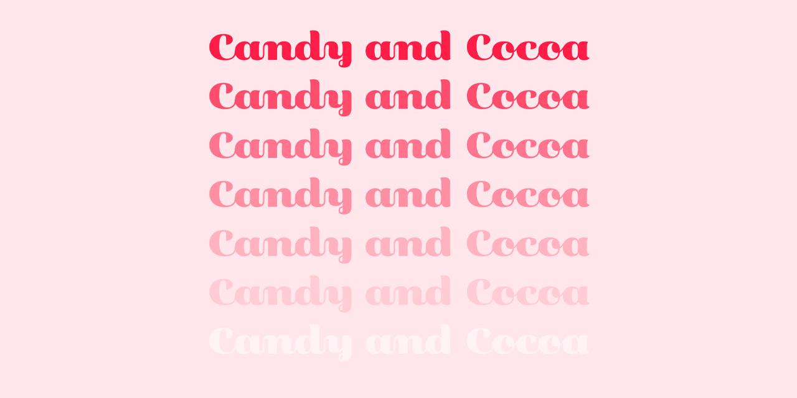
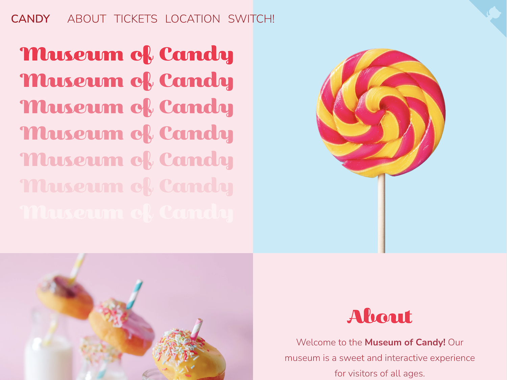

<p id="header"><p>

<table>
    <tr>
        <td><a href="https://github.com/emjose/box-of-shadows/#header"></a></td>
        <td><a href="https://github.com/emjose/one-hundred/#header"></a></td>
        <td><a href="https://github.com/emjose/candy-cocoa/#header"></a></td>
        <!-- <td><a href="https://github.com/emjose/****NEXT-REPO****/#header"></a></td> -->
    </tr>

</table>

<br>

<p id="project-title"><p>

<a href=#table-of-contents></a>

<br>

<a href="https://candy-cocoa.vercel.app/"></a>

#

<p id="table-of-contents"><p>

<a href=#table-of-contents></a>

- [100 Days of Code](#100days)
- [Installation](#installation)
- [Live Site](#live-site)
- [Improvement](#improvement)
- [Resources](#resources)
- [Copyright](#copyright)
- [Let's Connect!](#lets-connect)

<br>

#

<p id="100days"><p>

<a href=#100days></a>

### Day 39: December 29, 2022

- To refresh my knowledge of [Bootstrap](https://getbootstrap.com/), I completed the Bootstrap museum project (Section 13) from [Colt Steele's](https://www.youtube.com/c/ColtSteeleCode) Udemy course, [The Web Developer Bootcamp](https://www.udemy.com/course/the-web-developer-bootcamp/?utm_source=adwords&utm_medium=udemyads&utm_campaign=WebDevelopment_Search_la.EN_cc.US_PP_Control&utm_content=deal4584&utm_term=_._ag_141124571892_._ad_594318012127_._kw_online+web+developer+bootcamp_._de_c_._dm__._pl__._ti_kwd-327013416878_._li_9067609_._pd__._&matchtype=p&gclid=Cj0KCQiAwJWdBhCYARIsAJc4idACXm6Smdp_7UW-f4z52_th0pfK3UEjx4m4zphbJ0AsuFL6mpeVz5EaAuTBEALw_wcB).

- **[Candy and Cocoa](https://candy-cocoa.vercel.app/)** is inspired by ["Instagram Museums"](https://www.wired.com/story/selfie-factories-instagram-museum/) that offer immersive experiences in colorful art environments, such as the [Museum of Ice Cream](https://www.museumoficecream.com/).

- **[Candy and Cocoa](https://candy-cocoa.vercel.app/)** features two landing pages for a fictional museum with candy and cocoa themes.

- I made the following improvements to the original project:

  - Upgraded to Bootstrap 5.

  - Added light (candy) and dark (cocoa) modes.

  - Improved web performance and accessibility metrics.

  - Added [semantic HTML](https://www.w3schools.com/html/html5_semantic_elements.asp), footer, and modal components.

  - Updated styling and converted images to the [WebP format](https://developers.google.com/speed/webp).

  - Implemented keyboard navigation and gained [Progressive Web App](https://web.dev/progressive-web-apps/) status.

<br>

#

<p id="installation"><p>

<a href=#installation></a>

#### 1. Git clone and cd into the repo folder:

```console
git clone git@github.com:emjose/candy-cocoa.git && cd candy-cocoa
```

#### 2. Run the command:

```console
open index.html
```

<br>

#

<p id="live-site"><p>

<a href="https://candy-cocoa.vercel.app/"></a>

<a href="https://candy-cocoa.vercel.app/"></a>

<br>

• **[Candy and Cocoa](https://candy-cocoa.vercel.app/)** is responsive and can be viewed in mobile devices or computers.

• **[Candy and Cocoa](https://candy-cocoa.vercel.app/)** is keyboard-navigable and is a [progressive web app](https://developer.mozilla.org/en-US/docs/Web/Progressive_web_apps).

<a href=#live-site></a>

**I apologize for any delay in the loading of GIFs. Thank you for your patience.**

<br>

<details>
<summary>GIF demo: Candy Theme</summary>
<br>

<a href="https://candy-cocoa.vercel.app/"></a>

The candy theme has a pink / red / pastel color scheme, with a fixed navbar as a user scrolls.

#

</details>

<details>
<summary>GIF demo: Switching Themes</summary>
<br>

<a href="https://candy-cocoa.vercel.app/"></a>

Users can toggle between candy and cocoa themes with the switch link in the navbar.

#

</details>

<details>
<summary>GIF demo: Cocoa Theme</summary>
<br>

<a href="https://candy-cocoa.vercel.app/"></a>

The cocoa theme has a darker color scheme, with copy and media switching to cocoa references.

#

</details>

<details>
<summary>GIF demo: Modal Box</summary>
<br>

<a href="https://candy-cocoa.vercel.app/"></a>

Users can view the footer's modal box of acknowledgments and image credits.

#

</details>

<details>
<summary>GIF demo: Responsiveness</summary>
<br>

<a href="https://candy-cocoa.vercel.app/"></a>

On mobile devices and smaller screens, the navbar collapses into a hamburger menu button.

</details>

<br>

#

<p id="improvement"><p>

<a href=#improvement></a>

**There are several areas for improvement for the [Candy and Cocoa](https://candy-cocoa.vercel.app/) website:**

- Adding more content, media, and copy can enhance the user experience.

- While the website is scrolled, the navbar's background color does not always appear when the user switches modes or refreshes the page. For consistency, it would be ideal to maintain the navbar's background color.

- To improve responsiveness, editing the typography or swapping the hero images on smaller devices should be considered to ensure that the navigation links remain legible over the hero image.

- The repeating "Museum of" headlines at the top of the website are decorative and are hidden from the accessibility API using the **[`aria-hidden="true"`](https://developer.mozilla.org/en-US/docs/Web/Accessibility/ARIA/Attributes/aria-hidden)** attribute. However, Chrome DevTools flags these headlines for lack of color contrast. Further investigation and style editing is needed to improve accessibility for users who rely on assistive technologies.

<br>

#

<p id="resources"><p>

<a href=#resources></a>

- #### [Freepik](https://www.freepik.com/)

- #### [Unsplash](https://unsplash.com/)

- #### [jQuery API](https://api.jquery.com/)

- #### [Cloudinary](https://cloudinary.com/)

- #### [Bootstrap 5](https://getbootstrap.com/docs/5.0/getting-started/introduction/)

- #### [Adobe Fonts](https://fonts.adobe.com/)

- #### [Google Fonts](https://fonts.google.com/)

- #### [Fluid Typography](https://css-tricks.com/snippets/css/fluid-typography/)

- #### [Adobe Photoshop](https://www.adobe.com/creativecloud/buy/students.html)

- #### [Beautiful CSS Buttons](https://getcssscan.com/css-buttons-examples)

- #### [The Web Developer Bootcamp by Colt Steele](https://www.udemy.com/course/the-web-developer-bootcamp/?utm_source=adwords&utm_medium=udemyads&utm_campaign=WebDevelopment_Search_la.EN_cc.US_PP_Control&utm_content=deal4584&utm_term=_._ag_141124571892_._ad_594318012127_._kw_online+web+developer+bootcamp_._de_c_._dm__._pl__._ti_kwd-327013416878_._li_9067609_._pd__._&matchtype=p&gclid=Cj0KCQiAwJWdBhCYARIsAJc4idACXm6Smdp_7UW-f4z52_th0pfK3UEjx4m4zphbJ0AsuFL6mpeVz5EaAuTBEALw_wcB)

- #### [Stop Fixed Navigations Covering Content on Scroll](https://youtu.be/iGUSTyG-CYw)

- #### [My blog on how I created my Github READMEs](https://emmanueljose.medium.com/readme-a-makeover-story-b9c7be37a6de?sk=7ae6623d365409d875753e4604e42ffd)

<br>

#

<p id="copyright"><p>

<a href=#copyright></a>

- This project is for made for educational purposes only.

- This project was adapted from Colt Steele's Bootstrap project from his course, [The Web Developer Bootcamp](https://www.udemy.com/course/the-web-developer-bootcamp/?utm_source=adwords&utm_medium=udemyads&utm_campaign=WebDevelopment_Search_la.EN_cc.US_PP_Control&utm_content=deal4584&utm_term=_._ag_141124571892_._ad_594318012127_._kw_online+web+developer+bootcamp_._de_c_._dm__._pl__._ti_kwd-327013416878_._li_9067609_._pd__._&matchtype=p&gclid=Cj0KCQiAwJWdBhCYARIsAJc4idACXm6Smdp_7UW-f4z52_th0pfK3UEjx4m4zphbJ0AsuFL6mpeVz5EaAuTBEALw_wcB). © <a href="https://www.youtube.com/c/ColtSteeleCode">Colt Steele</a>. All Rights Reserved.

- Pink and yellow swirl lollipop – Image by [Freepik](https://www.freepik.com/free-photo/close-up-view-colorful-delicious-lollipop_10290607.htm#page=2&query=candy%20wrapper&position=0&from_view=keyword).

- Milk bottles with donuts – Photo by [Lidya Nada](https://unsplash.com/@lidyanada?utm_source=unsplash&utm_medium=referral&utm_content=creditCopyText) on [Unsplash](https://unsplash.com/photos/-iX-0JI8-0Y?utm_source=unsplash&utm_medium=referral&utm_content=creditCopyText).

- Gingerbread cookies with icing – [Image by pvproductions](https://www.freepik.com/free-photo/beautiful-gingerbread-cookies-children-s-party-form-sweets-candies-flat-lay_16213074.htm#query=candy%20pattern&position=7&from_view=keyword) on [Freepik](https://www.freepik.com/).

- Martini glass with sprinkles – Photo by [Amy Shamblen](https://unsplash.com/fr/@amyshamblen?utm_source=unsplash&utm_medium=referral&utm_content=creditCopyText) on [Unsplash](https://unsplash.com/photos/X3ijISYzlM4?utm_source=unsplash&utm_medium=referral&utm_content=creditCopyText).

- Chocolate bar in pieces – Photo by [Tamas Pap](https://unsplash.com/@tamasp?utm_source=unsplash&utm_medium=referral&utm_content=creditCopyText) on [Unsplash](https://unsplash.com/photos/6IDGTjq_Pic?utm_source=unsplash&utm_medium=referral&utm_content=creditCopyText).

- Chocolate ice cream in cones – Photo by [Mae Mu](https://unsplash.com/@picoftasty?utm_source=unsplash&utm_medium=referral&utm_content=creditCopyText) on [Unsplash](https://unsplash.com/photos/X5u6snvBCf0?utm_source=unsplash&utm_medium=referral&utm_content=creditCopyText).

- Chocolate macarons – Photo by [Melanie Boers](https://unsplash.com/@melanieboers?utm_source=unsplash&utm_medium=referral&utm_content=creditCopyText) on [Unsplash](https://unsplash.com/photos/eXVvchPsVTY?utm_source=unsplash&utm_medium=referral&utm_content=creditCopyText).

- Tiramisu cake slice – Photo by [BINYOUSSIF](https://unsplash.com/@binyoussif?utm_source=unsplash&utm_medium=referral&utm_content=creditCopyText) on [Unsplash](https://unsplash.com/photos/eRPE6WP5Qjc?utm_source=unsplash&utm_medium=referral&utm_content=creditCopyText).

<br>

#

<p id="lets-connect">

<a href=#lets-connect></a>

<p><a href="https://twitter.com/Emmanuel_Labor"></a> <a href="https://www.linkedin.com/in/emmanuelpjose/"></a> <a href="https://emmanueljose.medium.com/"></a> <a href="https://www.instagram.com/emmanuel_jose/"></a> <a href="mailto:emjose@gmail.com"></a> <a href="https://www.emmanuel-jose.com/"></a> <a href="https://github.com/emjose"></a></p>

#

<a href=#header></a>
